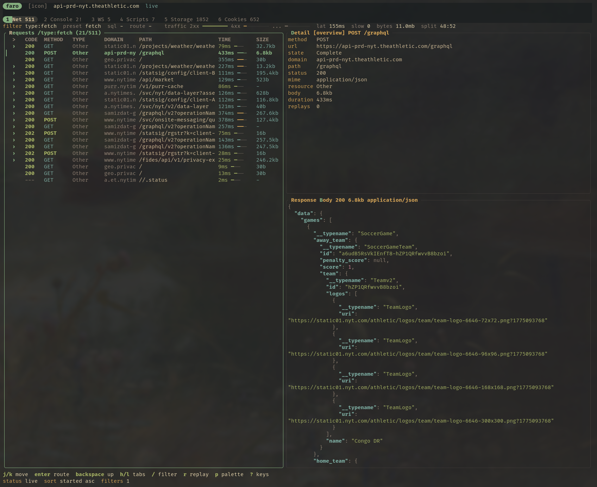

# Faro

Faro is a terminal-first browser debugging workbench for frontend and full-stack development.

It launches or attaches to a Chromium-family browser through the Chrome DevTools Protocol, captures browser observations into SQLite, and lets humans and agents inspect the result through a TUI, CLI, SQL, or MCP.



```text
Browser -> Chrome DevTools Protocol -> Faro capture -> SQLite -> TUI / CLI / MCP
```

Faro does not embed Chromium and does not render web pages in the terminal. It controls a real browser and keeps a durable local debugging database.

## Features

- Network request tree with route drilldown, filters, presets, response details, and replay history.
- WebSocket frame stream view with sent/received traffic, payload inspection, and filtering.
- Captured request/response headers, query params, request bodies, bounded text response bodies, SSE parsing, and small image previews where the terminal supports inline images.
- Console logs, page errors, and JavaScript scratch evaluation through `$EDITOR`.
- Storage and cookies views with captured snapshots and live mutation events.
- Copy any captured request as a full `curl` command.
- Replay captured requests with `curl`, persist replay status/body metadata, and review replay history in the request detail pane.
- Copy a redacted Markdown share bundle for a selected request when you need to send context to another person or agent.
- Read-only SQL editor in the TUI, plus CLI/MCP read-only SQL for agents.
- Agent-friendly CLI and MCP server for capture, inspection, replay, and SQL.
- TOML config in the platform config directory, with relative DB paths resolved there.

## Quick Start

### Install From Source

Prerequisites:

- Rust stable, edition 2024 capable.
- A Chromium-family browser: Chromium, Chrome, Brave, etc.
- `curl` for request replay.
- Optional: `nvim` or another `$EDITOR` for body editing, SQL, and console evaluation.

```sh
git clone <repo-url> faro
cd faro
cargo install --path crates/app
```

Run the TUI against a local app:

```sh
faro http://localhost:5173
```

Press `o` to launch the browser and start capture. Use eager launch when you want capture to start immediately:

```sh
faro --launch-on-start http://localhost:5173
```

Open a previously captured database without launching a browser:

```sh
faro tui ~/.config/faro/faro.db
```

### Run Without Installing

```sh
cargo run -- http://localhost:5173
cargo run -- --launch-on-start http://localhost:5173
```

### Attach To An Existing Browser

```sh
chromium --remote-debugging-port=9222 --user-data-dir=/tmp/faro-profile
faro --attach-port 9222 http://localhost:5173
```

Use `FARO_BROWSER=/path/to/chrome-or-chromium` to override browser discovery.

### Editor Handoff

Faro opens `$EDITOR` for SQL, console evaluation, body viewing/editing, storage edits, cookie edits, and replay editing. Terminal editors usually work as-is:

```sh
export EDITOR=nvim
```

GUI editors should be configured to wait until the file is closed:

```sh
export EDITOR="code --wait"
export EDITOR="zed --wait"
```

Without a wait flag, GUI editors may return immediately and Faro will resume before the file is saved.

## TUI Basics

Common keys:

```text
q/esc   quit
tab     switch focus
1-6     switch views: Network, Console, WebSockets, Scripts, Storage, Cookies
j/k     move focused selection
enter   drill into a route / expand selected tree item
backspace go up one route level
h/l     switch request detail tab
p       open command palette
o       open browser and start capture
y       copy selected request as curl
w       save selected request/response exchange to /tmp
r       replay selected request with curl
R       edit selected request in $EDITOR, then replay
D       diff original response body against latest replay response body
s       cycle request sort
S       open sessions manager
f       cycle quick network filter preset
e       open selected item in $EDITOR
u/d     scroll focused detail/body pane
g/G     jump to top/bottom in focused pane
/       filter requests
?       floating key/filter help
c       clear request filter
```

The sessions manager lets you switch between captured sessions and delete old sessions from the database. Press `S`, move with `j/k`, press `enter` to open a session, or `x` to delete the selected session.

Useful palette commands:

- `Copy Share Bundle`: copy a redacted Markdown request summary with headers, body previews, and replay history.
- `Sessions: Browse`: switch between or delete captured sessions with request/error/replay/storage counts.
- `Debug: Toggle Perf`: show frame, poll, capture, replay, and detail-load timing while tuning performance.

Request filters support plain text, structured fields, and case-insensitive regex patterns:

```text
method:post
status:2xx
status:404
type:fetch
domain:localhost
url:/api/users
path:/api
mime:json
header:x-request-id
body:error
reqbody:email
resbody:database
has:body
has:error
has:replay
duration:>500
size:>100kb
api/(users|teams)
path:/api/v[0-9]+
method:^(post|put)$
```

Quick presets include all, errors, JSON, fetch, XHR, SSE, images, scripts, styles, documents, with body, slow, large, and replayed.

## CLI

The CLI is designed for humans and agents that want to inspect Faro without opening the TUI.

Capture a page without the TUI:

```sh
faro capture https://example.com --for 15s --json
```

Inspect captured requests:

```sh
faro requests --route /api --filter "status >= 400" --json
faro request get <request-id> --body --json
faro request curl <request-id>
```

Inspect browser state:

```sh
faro console errors --json
faro storage get localStorage auth --json
faro cookies list --json
faro sessions list --json
```

Replay and query:

```sh
faro replay <request-id> --json
faro sql "select * from requests where status_code >= 500" --json
```

Clear captured sessions and their cascaded request/console/storage/cookie/replay rows:

```sh
faro sessions nuke --yes
```

Route filters accept:

- `/api/users`: exact route and descendants.
- `/api/users/:id`: one dynamic path segment.
- `/api/*`: wildcard for the rest of the path.

Use `--db <path>` with any command to target a specific SQLite database.

## MCP And Agent Integration

Faro includes a stdio MCP server so coding agents can inspect the same browser capture database that the TUI and CLI use. The server is DB-first: tools read from SQLite, replay captured requests, and can start short capture sessions, but they do not scrape the terminal UI.

```sh
faro mcp
```

Example MCP config:

```json
{
  "mcpServers": {
    "faro": {
      "command": "faro",
      "args": ["mcp"]
    }
  }
}
```

Most users should point their agent at the default config database. Use an explicit database when you want a project-specific capture or a disposable debugging session:

```json
{
  "mcpServers": {
    "faro": {
      "command": "faro",
      "args": ["--db", "/path/to/faro.db", "mcp"]
    }
  }
}
```

### Typical Agent Workflow

1. Start Faro normally while reproducing the issue, or let the agent run `capture_url`.
2. Have the agent call `list_sessions` and pick the right `session_id` when more than one capture exists.
3. Ask the agent to list failing or slow requests with `list_requests`.
4. Have it inspect a request with `get_request` and `get_response_body`.
5. Let it check console failures with `list_console_errors`.
6. Use `copy_request_as_curl` or `replay_request` when the bug needs a reproducible backend call.
7. Use `run_readonly_sql` for deeper analysis across the capture database.

Useful prompts:

```text
Use Faro to find failed network requests from the latest capture. Inspect the response bodies and summarize the likely backend or frontend issue.
```

```text
Use Faro to inspect requests under /api during the latest session. Find slow calls, replay the most suspicious request if safe, and show me the curl command.
```

```text
Use Faro read-only SQL to group captured requests by domain and status code. Highlight third-party failures and any unusually large responses.
```

### MCP Tools

| Tool | Purpose |
| --- | --- |
| `capture_url` | Launch or attach to Chromium and capture a URL for a bounded duration. |
| `list_sessions` | List capture sessions with request/error/replay/storage counts. |
| `delete_all_sessions` | Delete all sessions and cascaded captured data; requires `confirm: true`. |
| `list_requests` | List captured requests, with route/filter support for narrowing results. Accepts optional `session_id`. |
| `get_request` | Fetch request metadata, headers, response metadata, and body references. |
| `get_response_body` | Load a captured response body by request id. |
| `list_console_errors` | Return captured browser console errors. Accepts optional `session_id`. |
| `list_storage_items` | List current localStorage/sessionStorage items. Accepts optional `session_id` and filters. |
| `get_storage_item` | Read a current localStorage or sessionStorage item. |
| `list_cookies` | List current captured cookies. Accepts optional `session_id`. |
| `copy_request_as_curl` | Return a full `curl` command for a captured request. |
| `replay_request` | Replay a captured request and persist replay metadata. |
| `run_readonly_sql` | Run guarded read-only SQL against the Faro SQLite database. |

The same workflows are available from the CLI when an agent cannot use MCP:

```sh
faro capture https://example.com --for 15s --json
faro requests --filter "status >= 400" --json
faro request get <request-id> --body --json
faro request curl <request-id>
faro console errors --json
faro sql "select status_code, count(*) from requests group by status_code" --json
```

The importable agent package lives in:

```text
agents/faro/
```

It contains:

- `SKILL.md`: workflow instructions for agent tools.
- `mcp.json`: ready-to-copy MCP server config.

## Configuration

On first run, Faro creates `config.toml` in the platform config directory:

```text
Linux:   $XDG_CONFIG_HOME/faro/config.toml or ~/.config/faro/config.toml
macOS:   ~/Library/Application Support/faro/config.toml
Windows: %APPDATA%\faro\config.toml
```

The default database path is `faro.db` relative to the config directory. Faro also stores layout preferences, the last SQL query, and the persistent Chromium profile there.

```text
Linux:   ~/.config/faro/faro.db
macOS:   ~/Library/Application Support/faro/faro.db
Windows: %APPDATA%\faro\faro.db
```

Important config fields:

```toml
[app]
db_path = "faro.db"
launch_on_start = false

[ui]
bottom_fade_rows = 3

[theme]
text = "#d4be98"
muted = "#928374"
accent = "#89b482"
panel_title = "#d8a657"
panel_border = "#3c3836"
active_border = "#89b482"
```

The default theme is Gruvbox-inspired and can be customized with hex colors or supported terminal color names.

## Architecture

Workspace crates:

- `faro-core`: domain models and event types.
- `faro-store`: SQLite event store, projections, and read-only SQL guardrails.
- `faro-capture`: source-neutral ingestion pipeline.
- `faro-cdp`: Chrome DevTools Protocol capture/control plane.
- `faro`: CLI, TUI, and MCP entrypoint.

Captured data is persisted in SQLite so the TUI, CLI, SQL, and MCP all inspect the same source of truth.

## Development

Run the standard checks:

```sh
cargo fmt --check
cargo test
cargo clippy --all-targets --all-features -- -D warnings
rg -n "\.ok\(\)|\.unwrap\(\)|\.expect\(" crates
```

Run locally:

```sh
cargo run -- http://localhost:5173
cargo run -- capture http://localhost:5173 --for 10s --json
cargo run -- --db /tmp/faro.db mcp
```

## Current Limitations

- Faro currently targets Chromium-family browsers through CDP.
- Response body capture is bounded to avoid unbounded database growth.
- Storage mutation tracking is CDP DOMStorage-based; snapshots are used for baseline and reconciliation.
- Cookie mutation tracking uses HTTP `Set-Cookie` observation plus a page-side `document.cookie` observer.
- MCP support is intentionally narrow and DB-first; live page evaluation is still CLI/TUI-oriented.

## License

MIT
